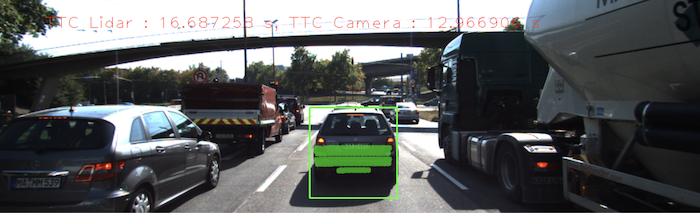

# 3D Object Tracking

Pre-requirements:
* keypoint detectors;
* descriptors;
* methods to match them between successive images;
* how to detect objects in an image using the YOLO deep-learning framework;
* how to associate regions in a camera image with Lidar points in 3D space.

Program schematic to see what have accomplished and what's still missing:


In this project, all the missing parts in the schematic to be implement.
To do this, four major tasks need to be completed: 
1. First, develop a way to match 3D objects over time by using keypoint correspondences. 
2. Second, compute the TTC based on Lidar measurements. 
3. Proceed to do the same using the camera, which requires to first associate keypoint matches to regions of
interest and then to compute the TTC based on those matches. 
4. And lastly, conduct various tests with the framework. The goal is to identify the most suitable
detector/descriptor combination for TTC estimation and also to search for problems that can lead to faulty
measurements by the camera or Lidar sensor.

NOTE: Kalman filter is a great way to combine the two independent TTC measurements into an improved version which is
much more reliable than a single sensor alone can be.

## Dependencies for Running Locally
* cmake >= 2.8
  * All OSes: [click here for installation instructions](https://cmake.org/install/)
* make >= 4.1 (Linux, Mac), 3.81 (Windows)
  * Linux: make is installed by default on most Linux distros
  * Mac: [install Xcode command line tools to get make](https://developer.apple.com/xcode/features/)
  * Windows: [Click here for installation instructions](http://gnuwin32.sourceforge.net/packages/make.htm)
* Git LFS
  * Weight files are handled using [LFS](https://git-lfs.github.com/)
* OpenCV >= 4.1
  * This must be compiled from source using the `-D OPENCV_ENABLE_NONFREE=ON` cmake flag for testing the SIFT and SURF detectors.
  * The OpenCV 4.1.0 source code can be found [here](https://github.com/opencv/opencv/tree/4.1.0)
* gcc/g++ >= 5.4
  * Linux: gcc / g++ is installed by default on most Linux distros
  * Mac: same deal as make - [install Xcode command line tools](https://developer.apple.com/xcode/features/)
  * Windows: recommend using [MinGW](http://www.mingw.org/)

## Basic Build Instructions

1. Clone this repo.
2. Make a build directory in the top level project directory: `mkdir build && cd build`
3. Compile: `cmake .. && make`
4. Run it: `./3D_object_tracking`.

# Implementation Details

## FP.1 Match 3D Objects

* `std::multimap` was used to track bounding box IDs;
* `std::make_pair(PreviousBoxId, CurrentBoxId)` was used to prepare a pair of bounding boxes into the multimap;
* In order to determine the best matches between frames, keypoint correspondences per BoundingBox-pair was counted;

```c++
std::multimap<int, int> mmStorage {};
...
// Set the best matching bounding box map with
// {key = Previous frame's most likely matching boxId, value = Current frame's boxId}
bbBestMatches.insert(std::make_pair(modeIdx, id));
```

* For more details see `camFusion_Student.cpp`

## FP.2 Compute Lidar-based TTC

* In each frame the median x-distance were taken in order to reduce the impact of outlier lidar points on TTC estimation;
* `TTC = dist_1 * (1.0 / frameRate) / (dist_0 - dist_1)`, where `dist_0` - the previous frame's closing distance, `dist_1` - the current frame's closing distance

```c++
  // In each frame, take the median x-distance
  sortLidarPointByX(lidarPointsPrev);
  sortLidarPointByX(lidarPointsCurr);

  // The previous frame's closing distance
  double dist_0 = lidarPointsPrev[lidarPointsPrev.size()/2].x;
  // The current frame's closing distance
  double dist_1 = lidarPointsCurr[lidarPointsCurr.size()/2].x;

  // (1.0 / frameRate) - the time elapsed between images
  TTC = dist_1 * (1.0 / frameRate) / (dist_0 - dist_1);
```

* For more details see `camFusion_Student.cpp`

## FP.3 Associate Keypoint Correspondences with Bounding Boxes

* Function `clusterKptMatchesWithROI(...)` is called for each bounding box and checks each matched key-point pair in an image;
* If the key-point is in the ROI (in the current frame), than the key-point match is associated with the current BoundingBox data structure.

```c++
// Associate a given bounding box with the keypoints it contains
void clusterKptMatchesWithROI(
  BoundingBox&               boundingBox,
  std::vector<cv::KeyPoint>& kptsPrev,
  std::vector<cv::KeyPoint>& kptsCurr,
  std::vector<cv::DMatch>&   kptMatches)
{
  // Loop over all matches in the current frame
  for (cv::DMatch match : kptMatches) {
    if (boundingBox.roi.contains(kptsCurr[match.trainIdx].pt)) {
      boundingBox.kptMatches.push_back(match);
    }
  }
}
```

* For more details see `camFusion_Student.cpp`

## FP.4 Compute Camera-based TTC

* The codebase for `computeTTCCamera` method is based on the example from lecture;
* Calculation of a TTC estimate based on 2D camera features: `TTC = (-1.0 / frameRate) / (1 - medianDistanceRatio)`

```c++
...
// Exclude outliers using Median
std::sort(distRatios.begin(), distRatios.end());
double medianDistanceRatio = distRatios[distRatios.size() / 2];

// Calculate a TTC estimate based on 2D camera features
TTC = (-1.0 / frameRate) / (1 - medianDistanceRatio);
```

* For more details see `camFusion_Student.cpp`

## FP.5 Performance Evaluation 1

In some frames the lidar estimated unreasonably high TTC (e.g. 16.68s).



This is because of some outliers (or even unstable points) from preceding vehicle's front mirrors.
In order to filter such a points, the `shrinkFactor` can be increased from 0.1 to 0.15.
As a result -  output is more accurate.

## FP.6 Performance Evaluation 2

The TOP-3 the best DETECTOR / DESCRIPTOR combinations in terms of a purpose of detecting keypoints on vehicles are:

* SHITOMASI / ORB (TTC Lidar = 11.9844, TTC Camera = 11.9741)
* SHITOMASI / BRISK (TTC Lidar = 12.6142, TTC Camera = 12.9876)
* SHITOMASI / BRIEF (TTC Lidar = 12.6787, TTC Camera = 13.2703)

The outsiders (with biggest TTC deltas) are the following pairs:

* HARRIS / BRIEF (TTC Lidar = 15.9082, TTC Camera = 35.3833)
* ORB / BRIEF (TTC Lidar = 14.091, TTC Camera = 88.5333)
* ORB / SIFT (TTC Lidar = 9.59863, TTC Camera = 18.4901)
